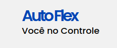

<p align="center">
    
</p>

<h2 align="center">
    AutoFlex
</h2>

### O AutoFlex foi projetado para ajudar motoristas casuais e profissionais. Com ele, você poderá identificar qual combustível é mais econômico, qual é a autonomia em quilômetros por litro e qual é o total das suas despesas com combustível

### Foram utilizados JavaScript como linguagem de programação, além de HTML, CSS, Git e GitHub como ferramentas e tecnologias, garantindo desempenho e uma boa experiência para os usuários

### O AutoFlex foi desenvolvido para simplificar a vida dos motoristas. Ele surgiu da necessidade de uma ferramenta prática para gerenciar o consumo e a autonomia de veículo, permitindo economizar tempo e dinheiro com poucos cliques

### Não existem pré-requisitos ou instruções de instalação para utilizar o AutoFlex

## Use o AutoFlex

1. Acesse o site do[AutoFlex](https://thiago-s-sousa.github.io/AutoFlex/)

2. Na página principal, escolha a opção que melhor atenda às suas necessidades

3. Preencha os campos do formulário conforme as especificações

## Colaboradores

<table>
  <tr>
    <td align="center">
      <a href="#">
        <br>
        <sub>
          <b>Thiago Santos</b>
        </sub>
      </a>
    </td>
  </tr>
</table>

## Contribuir

Se você quiser contribuir, clone este repositório, crie sua própria branch de trabalho e mãos à obra!

```bash
git clone https://github.com/Thiago-S-Sousa/AutoFlex.git
```

```bash
git checkout -b feature/NOME
```

No final, abra um Pull Request explicando o problema resolvido ou a funcionalidade adicionada. Se existir, adicione capturas de tela das modificações visuais e aguarde pela revisão!

[Como criar um Pull Request](https://www.atlassian.com/br/git/tutorials/making-a-pull-request) |
[Padrão de commits](https://gist.github.com/joshbuchea/6f47e86d2510bce28f8e7f42ae84c716)

## Licença

Copyright © By Thiago Santos. Este projeto está sob a licença [MIT](./../LICENSE) license
